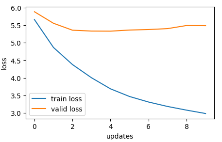
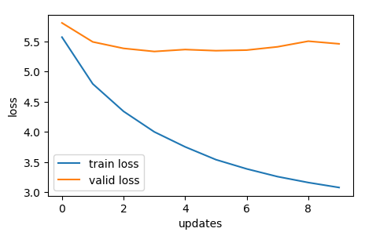
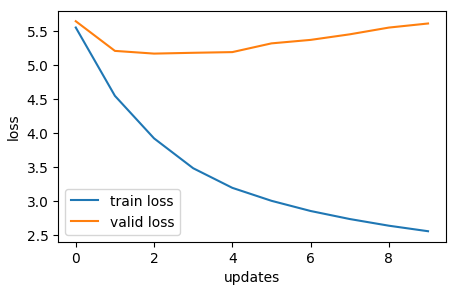
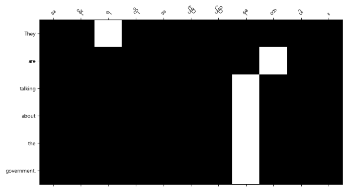
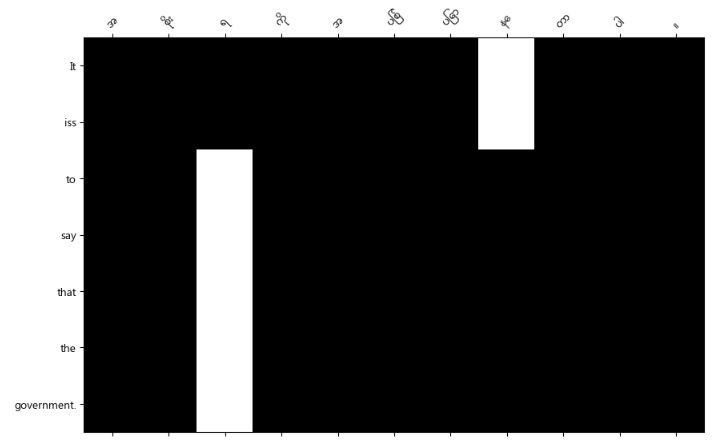
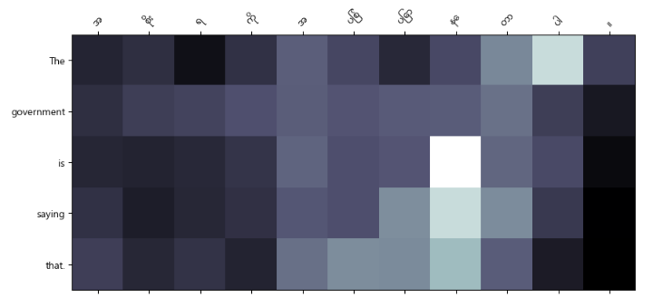

# NLP-A3-st124973

Machine Translation (Myanmar - English)
---------------------------------------
    There are a lot of steps to build a  machine tanslation system in real-world according to my experience in NLP. Although, this repository will be only for the assignemnt so many steps will not be performing to get the objectives.

Dataset -> [link](https://huggingface.co/datasets/Francis-Phone/mm_eng_news_translation)

Preparation Steps
-----------------

- Segmentation
    According to the researches, Burmese is natuarlly good at syllable level translation. In the web app, syllable segmentation is applied using my old code (utilities) because I am a former NLP Engineer.

- Alignment
    In machine translation, the most important thing is the alignment of the corpus. If there are many miss-aligned translations in the corpus, all will be wasted. In real-world case, we usually check the alignment manully and by code. Before training the translation model, we usually train alignment model using 'fast_align' to get the overall alignemnt of the training dataset.

- Punctuations and emojis (Noises)
    When data cleaning, the emojis and punctuations become noises and leading the model hard to understand the translation mostly. But in case, we can exclude some punctuations for some reasons.

- Domain and vocabularies
    In real world case, we usually train the model by domain and vocabularies. We also calculate perplexity of the training corpus to make the initial decision whether enough vocabularies or not. In this way, we can prevent from OOV (out of vocab). In this repository, it is only count the vocabularies to know the each language vocab sizes.

- Augmentation
    There are some synonyms in the dataset so it needs to be correctly augmented to make the model generalization.

- Tokenization 
    In this repository, Sentenpiece tokenizer is used for subword tokenization to make the deeper level understanding of each language.

Attentions
----------

General Attention:

ei = s^T hi ∈ R where d1 = d2

Multiplicative Attention: 

ei = s^TW hi ∈ R where W ∈ R^d2×d1

Additive Attention: 

ei = v^t tanh(W1hi + W2s) ∈ R

Training Results
----------------

train_size = 76,491
valid_size = 9,541 
test_size = 9,529 
input_dim   = 8,000
output_dim  = 30,000
emb_dim     = 256
hid_dim     = 512
dropout     = 0.5
lr = 0.001

| Attentions       | Training Loss | Training PPL | Validation Loss | Validation PPL | Testing Loss | Testing PPL |
|------------------|---------------|--------------|-----------------|----------------|--------------|-------------|
| General       |        2.984          |       19.774        |      5.487         |        241.547         |        5.322         |        204.841         |
| Multiplicative|         3.078          |       21.721        |       5.463        |         235.761        |        5.329         |        206.309         |
| Additive      |        2.559          |      12.918        |       5.616         |          274.853       |        5.174         |        176.562         |

| Attentions    | Duration per epoch |
|---------------|--------------------|
| General       |        6m 30s      |
| Multiplicative|        6m 34s      |
| Additive      |        7m 1s       |

Loss Graph
| General Attention Loss                                     | Multiplicative Attention Loss                                      | Additive Attention Loss                                       |
|----------------------------------------------|----------------------------------------------|----------------------------------------------|
|  |  |  |
 

Attention Heat Map
| General Attention Map                                     | Multiplicative Attention Map                                      | Additive Attention Map                                       |
|----------------------------------------------|----------------------------------------------|----------------------------------------------|
|  |  |  | 

Web App
-------

- python -m venv .venv/
- source .venv/Scripts/activate
- cd translation_system/
- pip install -r requirements.txt
- python manage.py runserver

Including -> Segmentation, Multiple Models, Translation History